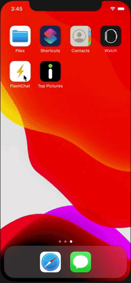
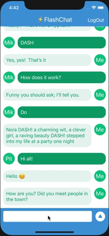
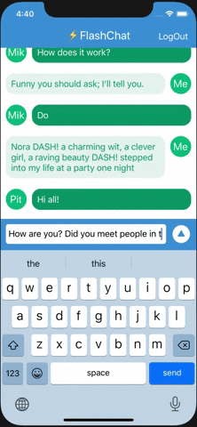

# FlashChat
Приложение для обмена сообщениями между зарегистрированными пользователями в общем чате. 
Архитектура MVC, реализовано: экран приветствия с анимацией UI, экран авторизации/регистрации, экран с чатом, 
изменение высоты поля ввода под размер текста, появление клавиатуры не перекрывает UI, 
аватарка на основе первых трех букв email пользователя, разный внешний вид сообщений (в зависимости от пользователя), 
проверка поля ввода (пустое или содержащие только пробелы не отправляется). 
Технологии: Firebase, GestureRecognizer, CustomCell xib, NotificationCenter, Timer. 

